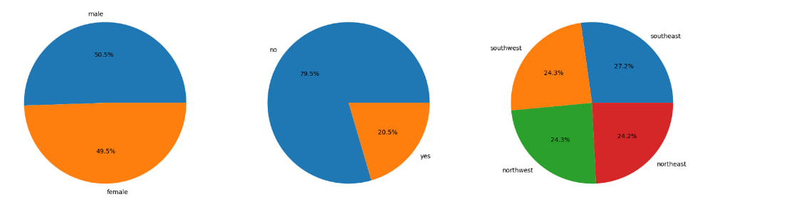
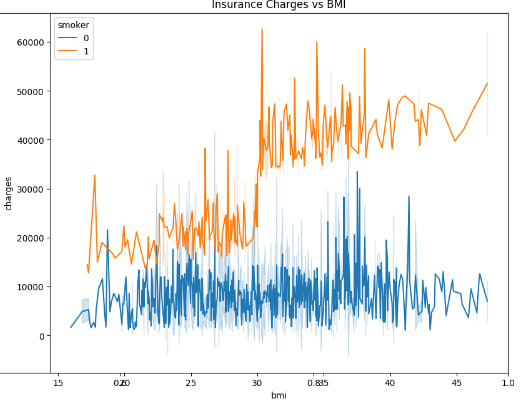
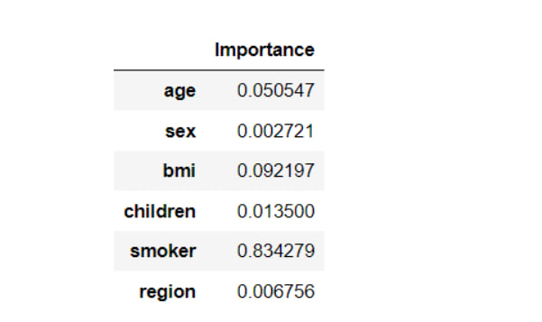
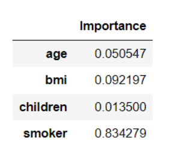

<h1 align="center">Forecasting Health Insurance Expenses Using Machine Learning</h1>

  <h4>Forecasting Health Insurance Expenses Using XGBoost</h4> 

# Overview
Health insurance cost prediction project describes the complete process for forecasting 
medical costs and aims at developing the optimal medical cost estimate for an individual or a patient in the future 
becoming robust and accurate. Actuarial modeling has emerged as one of the most vital protocols in the health 
insurance industry as it aids in the determination of effective and competitive premiums that can facilitate the 
retention and attracting of members Most of these issues are complex in nature since they involve a variety of 
factors, such as client population’s structure, health status, and lifestyles, as well as the determinants of medical 
service resources. Additional factors such as the breadth of coverage offered, type of plan, deductibles, and 
customer age also affect cost estimation. Efficiency and clarity of such processes cannot be understated especially 
after the COVID-19 pandemic.
# Dataset Description
The dataset which is largely sourced from Kaggle and other open datasets contains relative data for 1,338 people who were subject to possible medical insurance costs.The most important are: 
1. Age: numerical; elderly people majorly incur higher age incidence expenses in medical care. 
2. Gender: categorical; male or female whom sometimes the insurance companies use to measure risk differently. 
3. BMI: numerical; body mass index which affects all who a person’s weight is deemed too large and associated with many health risks hence higher insurance rates. 
4. Children (numerical): The number of people being cared for; having numerous children will raise the costs associated with health care for the entire family. 
5. Smoker(categorical): A yes/no question on whether the person smokes or not with a positive correlation with the cost of healthcare. 
6. Region(categorical): The area in which they live (northeast, northwest, southeast, southwest) possibly where they live determines the specific health risk and premium matching their area.
# Some Screenshots

• **The percentages in each segment represent the proportion of data points in that category.**  

• **A person who smoke and have BMI above 30 tends to have a higher medical cost**  

• **A person who smoke and have BMI above 30 tends to have a higher medical cost**  

• **Correlation Heatmap of Features and Target Variable (Charges)**  

# Feature Importance

• **Importance of individual features**  

• **Most important features for predicting of charges**  

# Model Evaluation

| Score | LinearRegression | Support Vector Machine | RandomForest | Gradient Boost| XGBoost|
| ----------- | ----------- | ----------- | ----------- | ----------- | ----------- |
| Train Accuracy | 0.729 | -0.105 | 0.97 | 0.868 |0.870 |
| Test Accuracy | 0.806 | -0.134 | 0.882 | 0.901 | 0.904 |
| CV Score | 0.747 | 0.103 | 0.836 | 0.860 | 0.860 |

# Conclusion
Model gave 90% accuracy for Medical Insurance Amount Prediction using XGBoost. This project demonstrates the effectiveness of machine learning, particularly XGBoost, in accurately predicting medical insurance costs based on key factors. It aims to enhance cost transparency and planning, benefiting both insurers and customers.
